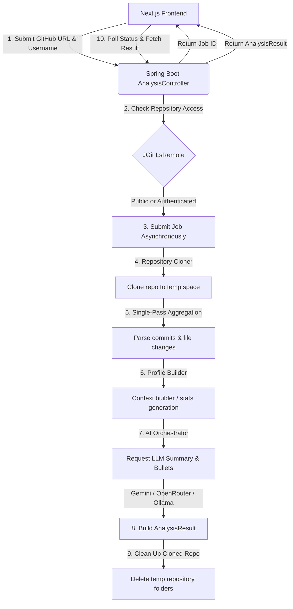

# 🔍 DevTrace

> **Transform Raw GitHub Contributions into Career-Ready Achievements Instantly.**

DevTrace is a high-performance developer contribution analyzer and AI-powered report generator. By scanning Git repositories, DevTrace compiles deep analytics on a contributor’s commit frequency, file changes, technology footprints, and key development patterns, automatically outputting achievement-oriented resume bullet points and professional LinkedIn summaries.

---

## 📺 Video Demonstration

Experience DevTrace in action! Click the preview thumbnail below to watch the video demonstration on Google Drive:

<div align="center">
  <a href="https://drive.google.com/file/d/1PnN8BhPLxZuhIrdEmKomr1J2SXVxtbZc/view?usp=drive_link" target="_blank" rel="noopener noreferrer">
    
  </a>
  <p><em>Click the image above to open the video walkthrough on Google Drive.</em></p>
</div>

---

## ✨ Key Features

- **🔍 Deep Commit & Code Analysis**: Scans complete commit logs, tracks additions/deletions, extracts file extensions, and runs keyword mapping on commit logs using a high-performance custom parser.
- **✍️ AI Resume Bullet Generator**: Leverages LLMs to transform commit data into professional, impact-driven resume bullets using the **Action Verb + Metric + Outcome** framework.
- **👔 LinkedIn Profile Optimizer**: Instantly drafts professional summary updates summarizing your codebase contributions.
- **📊 Interactive Technical Dashboards**: Visually represents engineering footprint breakdowns (Frontend vs. Backend vs. DevOps) with modern responsive charts.
- **🔐 Secure Repository Verification**: Supports both public repositories and authenticated scanning of private repositories using secure GitHub OAuth credentials.
- **⚡ Resilient AI Orchestration**: Decoupled multi-provider API fallback pipeline supporting **Gemini (Primary)**, **OpenRouter (DeepSeek R1)**, and local **Ollama** runtimes.

---

## 🛠️ Tech Stack

### Frontend
- **Framework**: Next.js 15+ (App Router)
- **Language**: TypeScript
- **Styling**: Tailwind CSS
- **Animations**: Framer Motion
- **Visualizations**: Recharts

### Backend
- **Framework**: Spring Boot 4.0.6
- **Language**: Java 21
- **Authentication**: Spring Security & OAuth2 Client
- **Git Operations**: Eclipse JGit (`7.3.0`)
- **LLM Integrations**: Native Spring RestClient integrations for Gemini, OpenRouter, and Ollama APIs.

---

## 📐 Architecture & Workflow

DevTrace runs a non-blocking asynchronous pipeline designed to handle repositories of any scale.



---

## 🚀 Getting Started & Local Setup

### Prerequisites
- **Java 21 JDK** installed
- **Node.js 18+** & **npm** installed
- A **GitHub Developer Account** to set up OAuth Credentials

---

### 1. Backend Setup

1. Navigate to the `backend` directory:
   ```bash
   cd backend
   ```

2. Create a local environment config file or set the following environment variables. You can configure them in an `application-local.yml` or export them directly:
   ```yaml
   GITHUB_CLIENT_ID: your_github_oauth_client_id
   GITHUB_CLIENT_SECRET: your_github_oauth_client_secret
   DEVTRACE_FRONTEND_URL: http://localhost:3000
   GEMINI_API_KEY: your_google_gemini_api_key
   ```

3. Run the Spring Boot application using Maven:
   ```bash
   ./mvnw spring-boot:run
   ```
   The server will start on port `8080` (accessible at `http://localhost:8080`).

---

### 2. Frontend Setup

1. Navigate to the `frontend` directory:
   ```bash
   cd ../frontend
   ```

2. Install dependencies:
   ```bash
   npm install
   ```

3. Create a `.env.local` file in the root of the `frontend` folder and add:
   ```env
   NEXT_PUBLIC_API_BASE_URL=http://localhost:8080
   ```

4. Run the development server:
   ```bash
   npm run dev
   ```
   Open [http://localhost:3000](http://localhost:3000) in your browser to view the application.

---

## 📡 API Reference

### Repository Analysis

#### Start Analysis Job
- **Endpoint**: `POST /api/analysis/start`
- **Request Body**:
  ```json
  {
    "repositoryUrl": "https://github.com/octocat/Hello-World",
    "githubUsername": "octocat"
  }
  ```
- **Response**:
  ```json
  {
    "jobId": "a1b2c3d4-e5f6-7a8b-9c0d-1e2f3a4b5c6d"
  }
  ```

#### Get Job Status
- **Endpoint**: `GET /api/analysis/{jobId}/status`
- **Response**:
  ```json
  {
    "jobId": "a1b2c3d4-e5f6-7a8b-9c0d-1e2f3a4b5c6d",
    "status": "RUNNING",
    "progress": 60
  }
  ```

#### Get Job Results
- **Endpoint**: `GET /api/analysis/{jobId}/result`
- **Response**: Returns full contribution metrics, git statistics, and the generated AI profile (resume points, LinkedIn summaries).

#### Verify Repo Visibility
- **Endpoint**: `GET /api/analysis/verify?repositoryUrl={url}`
- **Response**: State of access (`PUBLIC`, `PRIVATE_ACCESSIBLE`, `PRIVATE_NOT_ACCESSIBLE`, `NOT_FOUND`).

---

